# Amor

<h1 align="center">
  <a href="https://david-legend.github.io/amor/" target="_blank">https://david-legend.github.io/amor/</a>
</h1>

    This is Amor, a beautifully designed portfolio website built with <strong>flutter</strong>.

    It is inspired by <a href="https://www.behance.net/gallery/95351691/Resume-Design-03" target="_blank">Adeel Raza's Designs on Behance</a>

  

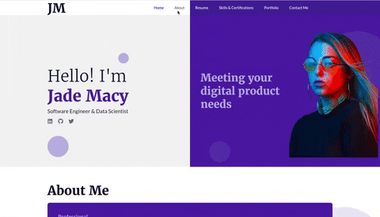
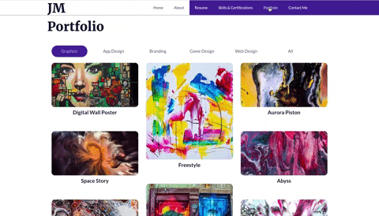

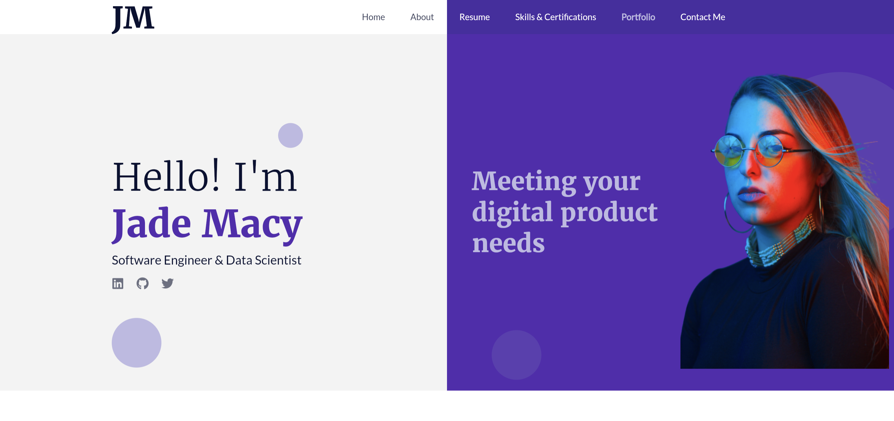
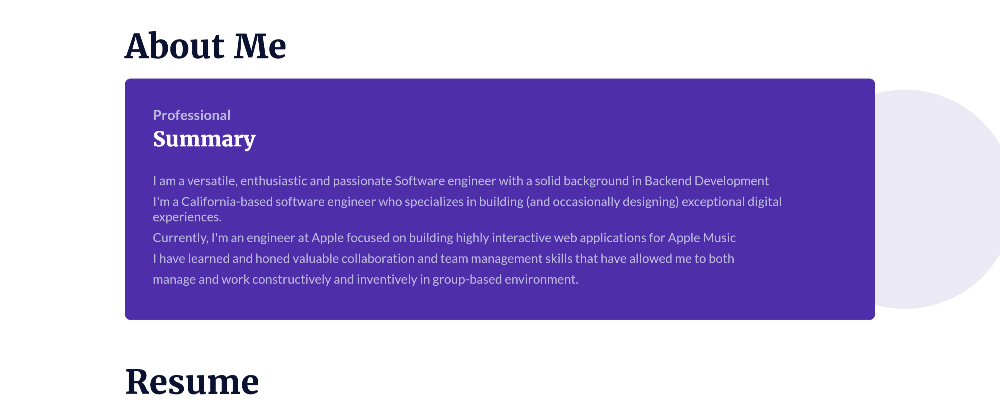
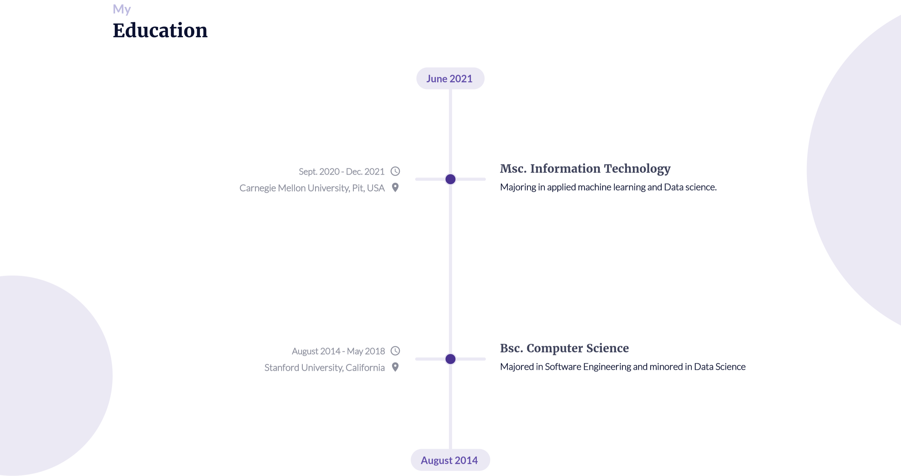
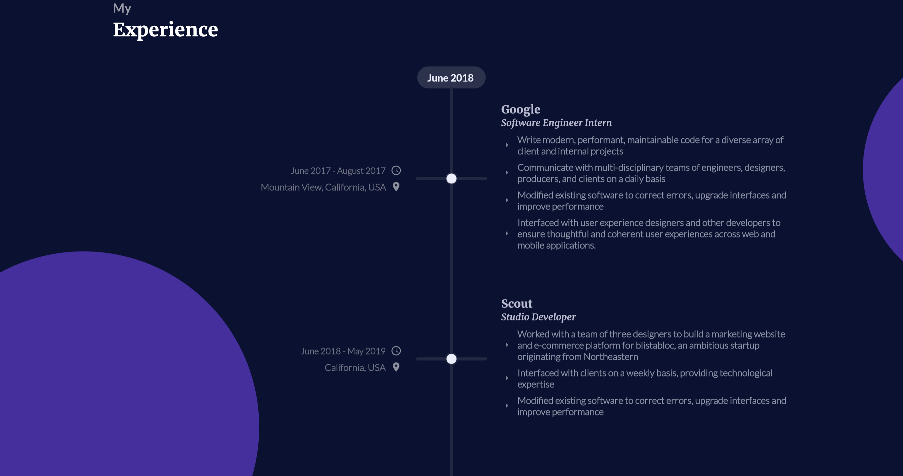
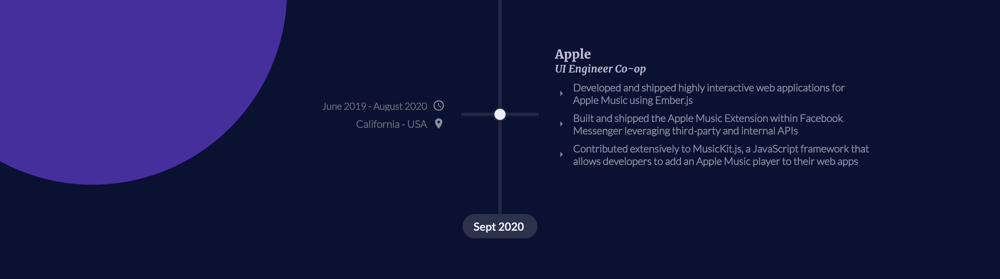
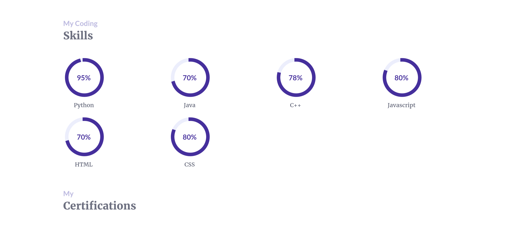
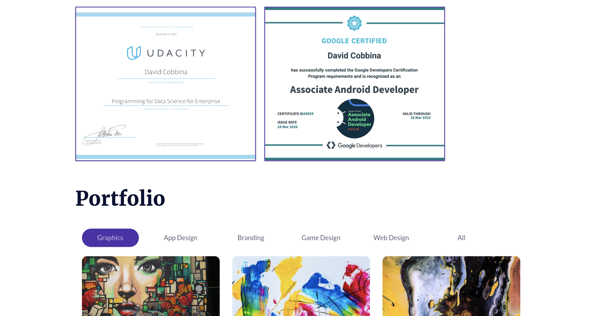
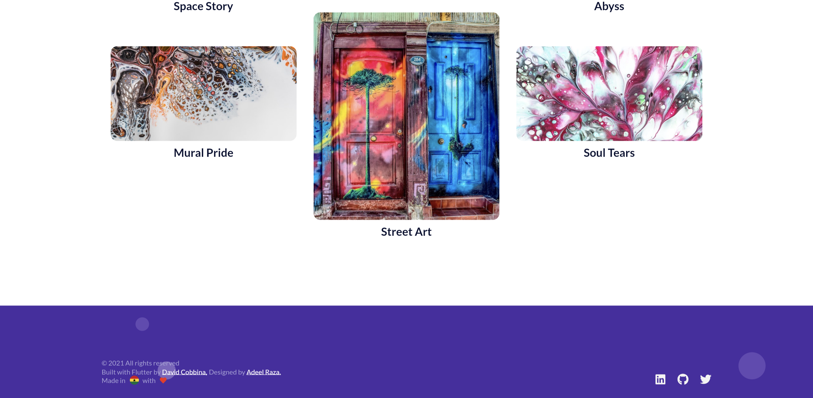

  
  

## Actual Designs Used

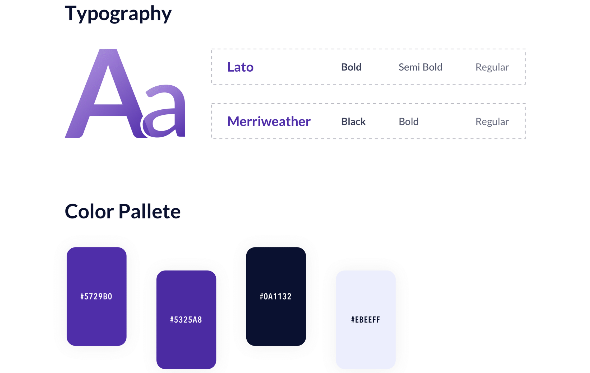
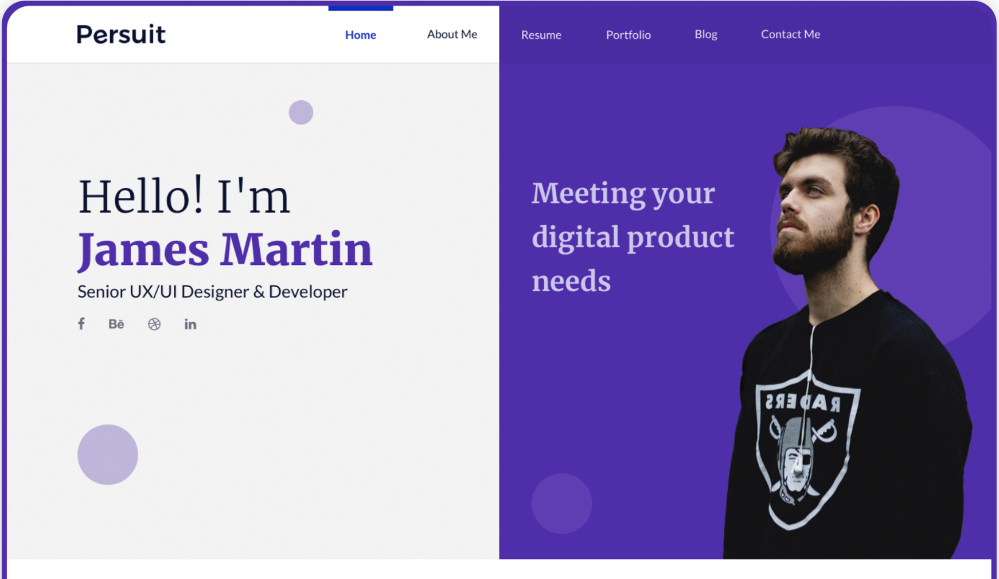
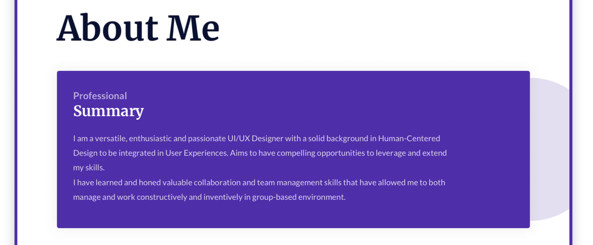
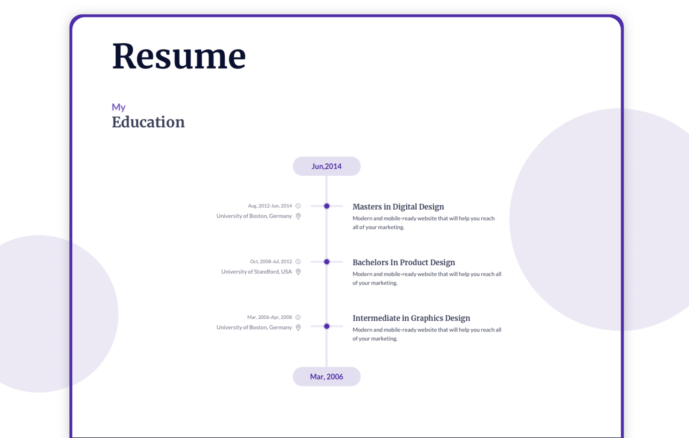
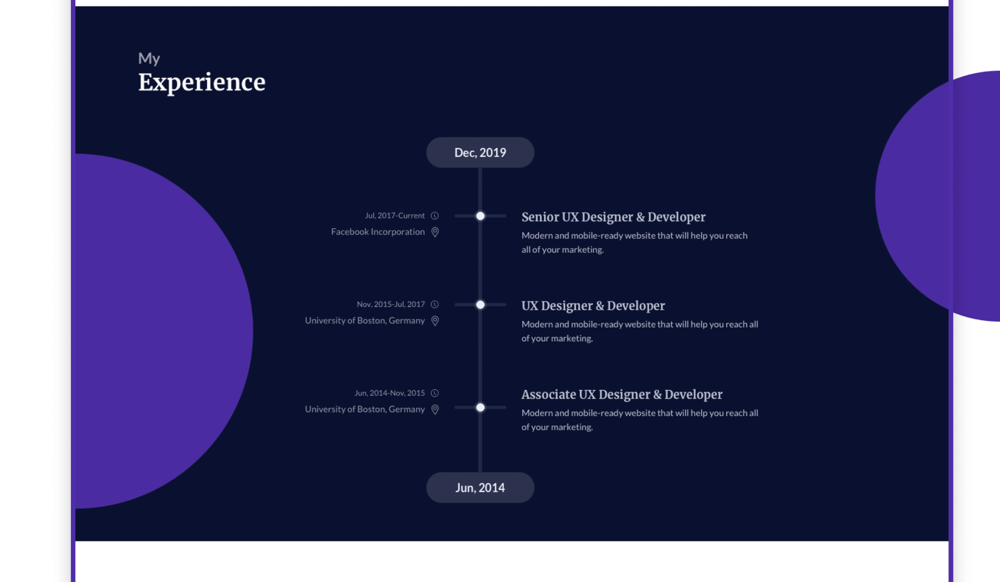
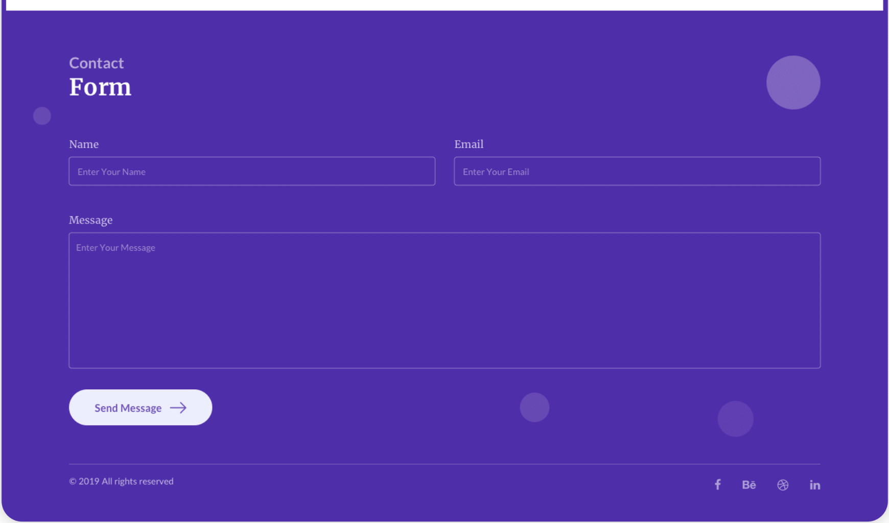